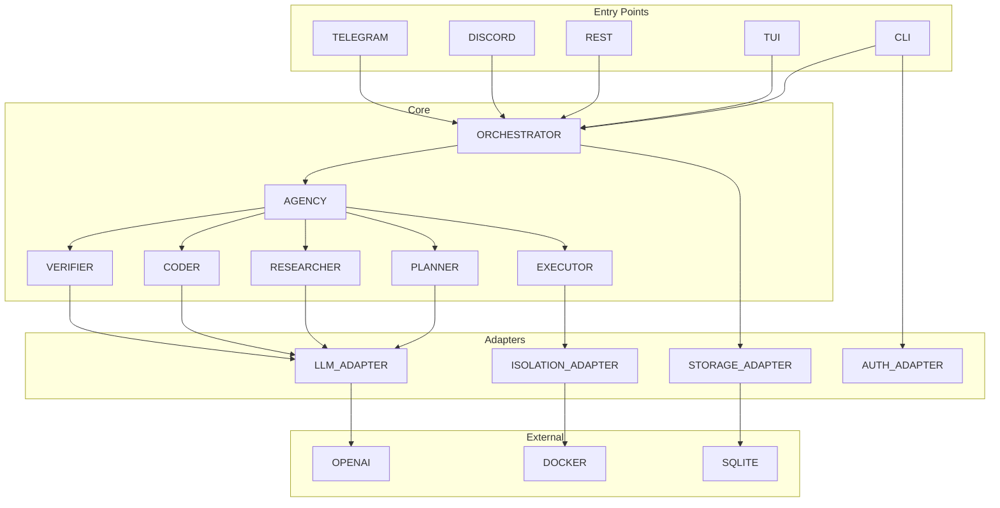

# Components Reference

This section provides detailed documentation for Navi's core components.

## Components

| Component | Description | Documentation |
|-----------|-------------|---------------|
| **Isolation Adapters** | Sandbox execution backends (Docker, Bubblewrap, Native) | [isolation-adapters.md](isolation-adapters.md) |
| **Agents** | Multi-agent system (Planner, Researcher, Coder, Executor, Verifier) | [agents.md](agents.md) |
| **LLM Adapters** | Language model integrations (OpenAI, Anthropic, Ollama) | *coming soon* |
| **Storage** | Event log and workspace state persistence | *coming soon* |
| **Authentication** | Auth methods (local, OAuth, bots) | [../security/model.md](../security/model.md) |
| **Interfaces** | CLI, TUI, REST API, Discord, Telegram | [../interfaces/index.md](../interfaces/index.md) |

## Component Architecture



## Quick Navigation

### By Use Case

- **Understanding the architecture** → [Architecture Overview](../architecture/overview.md)
- **Security questions** → [Security Model](../security/model.md)
- **How to build/run** → [Getting Started](../getting-started.md) (coming soon)
- **Contributing code** → [CONTRIBUTING.md](../CONTRIBUTING.md)

### By Component Type

- **Ports & Interfaces** → See [architecture/overview.md](../architecture/overview.md#ports-interfaces)
- **Adapters** → See component pages below
- **Orchestrator** → See [agents.md](agents.md) (orchestration logic)
- **Configuration** → [getting-started.md](../getting-started.md#configuration)

## Component Details

### Isolation Adapters

Provides sandboxed execution environments. Implements `IsolationPort`.

**Implemented**:
- Docker adapter: `internal/adapters/docker_adapter.go`
- Bubblewrap adapter: `internal/adapters/bubblewrap_adapter.go`
- Native adapter: `internal/adapters/native_adapter.go`

**Documentation**: [isolation-adapters.md](isolation-adapters.md)

### Agents

Specialized workers that form the multi-agent system. Each agent type has a single responsibility.

**Implemented**:
- Planner: `internal/agents/planner.go`
- Researcher: `internal/agents/researcher.go`
- Coder: `internal/agents/coder.go`
- Executor: `internal/agents/executor.go`
- Verifier: `internal/agents/verifier.go`

**Documentation**: [agents.md](agents.md)

### LLM Adapters

Integrations with various LLM providers. All implement `LLMPort`.

**Implemented**:
- OpenAI adapter: `internal/adapters/openai_adapter.go` (incomplete)
- Anthropic adapter: `internal/adapters/anthropic_adapter.go` (planned)
- Ollama adapter: `internal/adapters/ollama_adapter.go` (planned)

**Status**: OpenAI adapter needs completion; Anthropic and Ollama not started.

### Storage

Event sourcing and workspace state persistence. Implements `RepositoryPort`.

**Implemented**:
- SQLite repository: `internal/storage/sqlite_repo.go` (planned)
- Postgres repository: `internal/storage/postgres_repo.go` (future)

**Status**: Storage layer not implemented yet.

### Authentication

User authentication and authorization. Implements `AuthPort`.

**Implemented**:
- Local token auth: `internal/auth/local_auth.go` (planned)
- OAuth adapters: `internal/auth/oauth_*.go` (future)

**Status**: Auth layer not implemented yet.

### Interfaces

User-facing entry points.

**Implemented**:
- CLI: `cmd/cli/main.go` (basic)
- TUI: `internal/tui/tui.go` (prototype)

**Planned**:
- REST API: `cmd/api/main.go` or `internal/api/server.go`
- Discord bot: `internal/bots/discord.go`
- Telegram bot: `internal/bots/telegram.go`

**Documentation**: [../interfaces/index.md](../interfaces/index.md)

## Package Structure

```
internal/
├── domain/
│   └── provider.go          # Ports (interfaces)
├── adapters/
│   ├── openai_adapter.go   # LLM implementations
│   ├── docker_adapter.go   # Isolation implementations
│   ├── bubblewrap_adapter.go
│   └── native_adapter.go
├── agents/
│   ├── planner.go
│   ├── researcher.go
│   ├── coder.go
│   ├── executor.go
│   └── verifier.go
├── orchestrator/
│   └── orchestrator.go     # Main coordination logic
├── storage/
│   └── repository.go       # Event/log persistence
├── auth/
│   └── auth.go             # Authentication & authorization
├── tui/
│   └── tui.go              # Terminal UI
└── config/
    └── config.go           # Configuration loading
```

## Dependencies Between Components

**IMPORTANT**: Follow the dependency rule:

```
entry points → orchestrator → ports
                                 ↓
                           adapters (implement ports)
```

Never have:
- Core depending on adapters
- Adapters depending on each other
- Entry points bypassing orchestrator

If you need to add a new component, add it as:
- **Port** in `internal/domain/` (if it's a new category of adapter)
- **Adapter** in `internal/adapters/` (if implementing existing port)
- **Agent** in `internal/agents/` (if new agent type)
- **Entry point** in `cmd/` or `internal/bots/`

## Testing Components

Each component should have:
- Unit tests in `*_test.go` files
- Mock implementations for dependencies (see `internal/testing/` for helpers)
- Integration tests where applicable

Run tests:

```bash
go test ./...           # All tests
go test ./internal/...  # Internal packages only
go test -v ./...        # Verbose
go test -race ./...     # Race detection
```

## Code Style

- Follow [Effective Go](https://golang.org/doc/effective_go)
- Use `gofmt` (automatic formatting)
- Add godoc comments for exported items
- Errors should be wrapped with `%w` when appropriate
- Prefer `context.Context` as first parameter
- interfaces should be small (single method is ideal)
- Use dependency injection (pass dependencies as parameters, not global variables)

## License

All components are MIT licensed. See [../LICENSE](../LICENSE).
